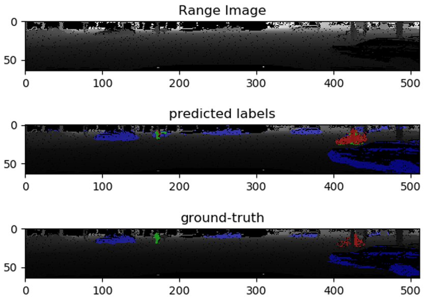
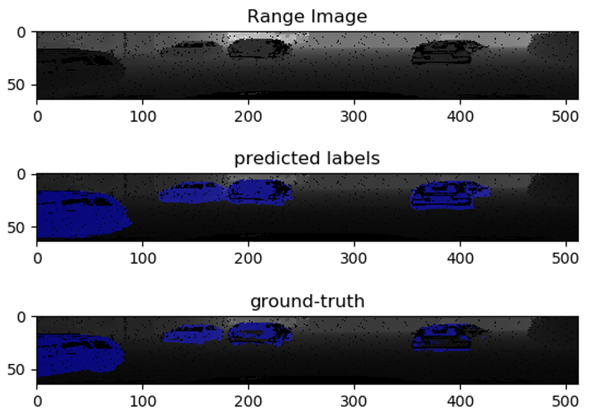
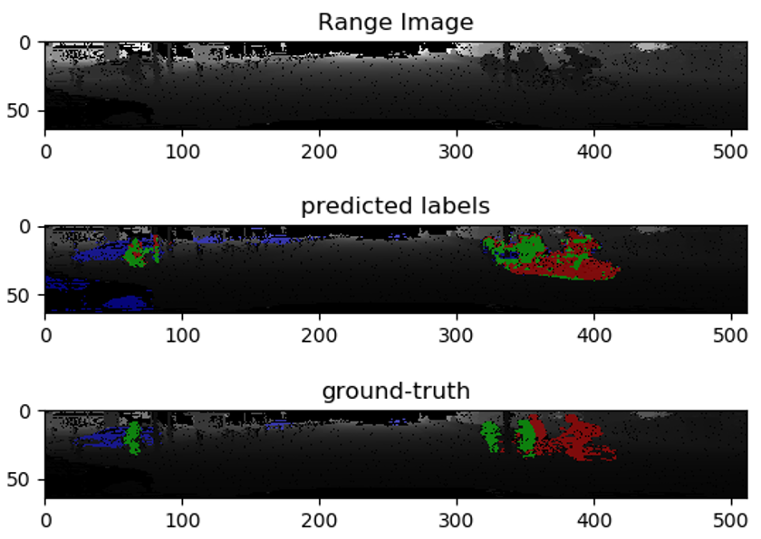
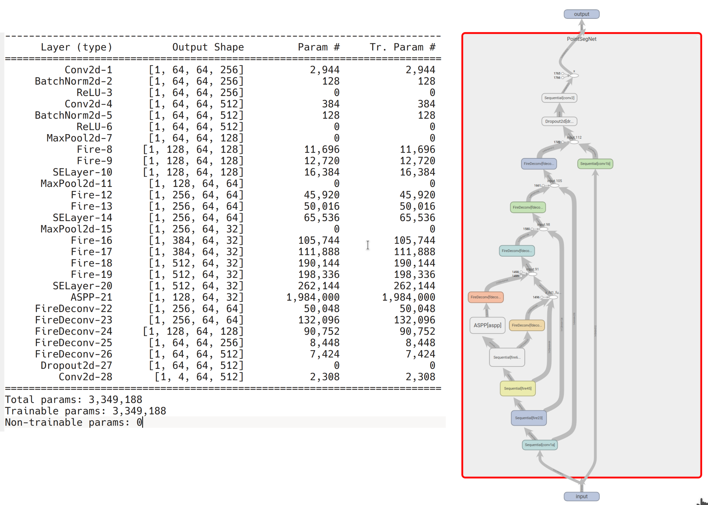

# PointSeg
This repository is the __pytorch__ implementation of [PointSeg](https://arxiv.org/abs/1807.06288)

```
@article{Wang2018PointSegRS,
  title={PointSeg: Real-Time Semantic Segmentation Based on 3D LiDAR Point Cloud},
  author={Yuan Wang and Tianyue Shi and Peng Yun and Lei Tai and Ming Liu},
  journal={ArXiv},
  year={2018},
  volume={abs/1807.06288}
}
```

## Dependencies
- Pytorch 1.4 >
- Open3d [optional, just for visualization]
- Tensorboard [optional, for examining the training outputs]

## Dataset
The dataset used for training PointSeg is the same as [squeezeseg](https://github.com/xuanyuzhou98/SqueezeSegV2), which can be downloaded from 
[here](https://www.dropbox.com/s/pnzgcitvppmwfuf/lidar_2d.tgz?dl=0).

## Results




## Usage 

#### Training

Example:

> ~ cd PointSeg
>
> ~ python --csv-path ImageSet/csv/ --data-path /path/to/Datasets/lidar_2d/ -c ./config.yaml -j 4 -b 16 --lr 0.01 --device cuda

One __pretrained__ model can be found in _checkpoints_-folder. 

#### Evaluating

> ~ cd PointSeg
>
> ~ python --csv-path ImageSet/csv/ --data-path /path/to/Datasets/lidar_2d/  -c ./config.yaml -j 4 -b 16 --device cuda -m checkpoints/checkpoint_30_20200502_190744.tar --ds-type=train

Note that during the evaluation the results of each prediction is saved as a numy-file in the "_test-pred_"-folder.
Each saved numpy-file consits of 5 channels (x, y, z, predicted labels, ground-truth labels).

#### Tensorboard
The results of training or evaluation can be inspected using tensorboard. Note that one tensorboard-file for the trainig is already provided.
See "runs"-foler.

> ~ cd PointSeg
>
> tensorboard --logdirs=runs

## Netwrok Architecture



##